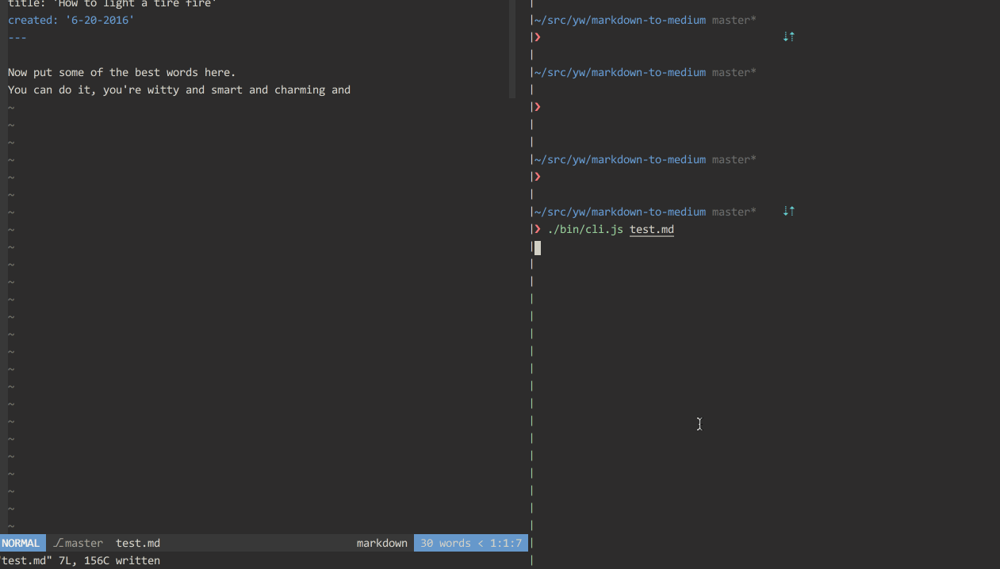

# markdown-to-medium [![stability][0]][1]
[![npm version][2]][3] [![downloads][8]][9] [![js-standard-style][10]][11]

Publish markdown to Medium. Extracted from @jxnblk's
[script](https://github.com/jxnblk/writing/blob/gh-pages/medium.js) (thank him
if you see him).



## Getting Started
1. [Get a third party integration token on medium][register]
2. Install `markdown-to-medium`
2. Copy the token to the clipboard
3. Create an article with the token passed through `--token`
4. The token is now stored locally for future use, rinse repeat

## Usage
```txt
Usage: markdown-to-medium <path to markdown>

Options:
  -h, --help        Output usage information
  -v, --version     Output version number
  -t, --token       Pass in the user token, stored after first use
  -i, --id          Pass in the user id
  -u, --canonicalUrl  Add a cross-reference to the original url for post
  --title           Pass in the title
  --tags            Pass in tags
  --publication     Publish to a Medium publication

Examples:
  $ markdown-to-medium ./foobar.md
  # Publish markdown to medium

  $ markdown-to-medium ./foobar.md  --tags={tag1,tag2} --title="Hello world"
  # Publish markdown to medium

Docs: https://github.com/yoshuawuyts/markdown-to-medium
Bugs: https://github.com/yoshuawuyts/markdown-to-medium/issues
```

## Metadata

To get the correct title and date to show up without using options, you can
use `YAML` frontmatter in your markdown:

```md
---
title: 'How to light a tire fire'
created: '6-20-2016'
publication: 'Intention and Integrity'
canonicalUrl: 'https://example.com/how-to-light-a-tire-fire'
tags: ['fire', 'tires']
---

Now put some of the best words here.
You can do it, you're witty and smart and charming and
```

Note that `tags`, `canonicalUrl`, and `publication` are optional, and that
`created` is not passed through to Medium.

## Installation
```sh
$ npm install --global markdown-to-medium
```

## See Also
- [medium api docs](https://github.com/Medium/medium-api-docs)
- [jxnblk/writing](https://github.com/jxnblk/writing)

## License
[MIT](https://tldrlegal.com/license/mit-license)

[register]: https://medium.com/me/settings
[0]: https://img.shields.io/badge/stability-experimental-orange.svg?style=flat-square
[1]: https://nodejs.org/api/documentation.html#documentation_stability_index
[2]: https://img.shields.io/npm/v/markdown-to-medium.svg?style=flat-square
[3]: https://npmjs.org/package/markdown-to-medium
[4]: https://img.shields.io/travis/yoshuawuyts/markdown-to-medium/master.svg?style=flat-square
[5]: https://travis-ci.org/yoshuawuyts/markdown-to-medium
[6]: https://img.shields.io/codecov/c/github/yoshuawuyts/markdown-to-medium/master.svg?style=flat-square
[7]: https://codecov.io/github/yoshuawuyts/markdown-to-medium
[8]: http://img.shields.io/npm/dm/markdown-to-medium.svg?style=flat-square
[9]: https://npmjs.org/package/markdown-to-medium
[10]: https://img.shields.io/badge/code%20style-standard-brightgreen.svg?style=flat-square
[11]: https://github.com/feross/standard
